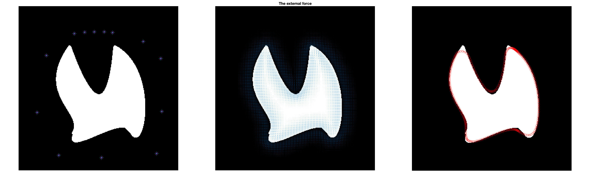
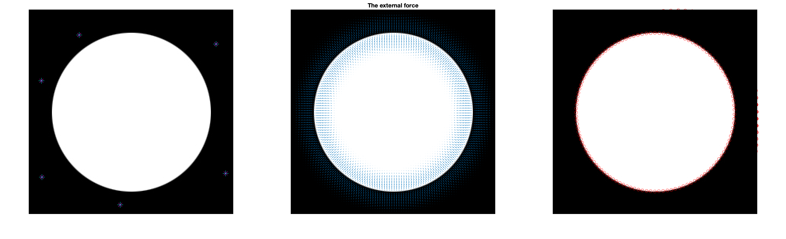
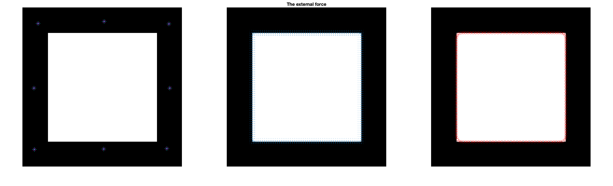
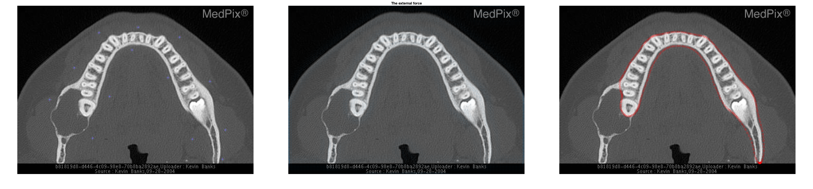
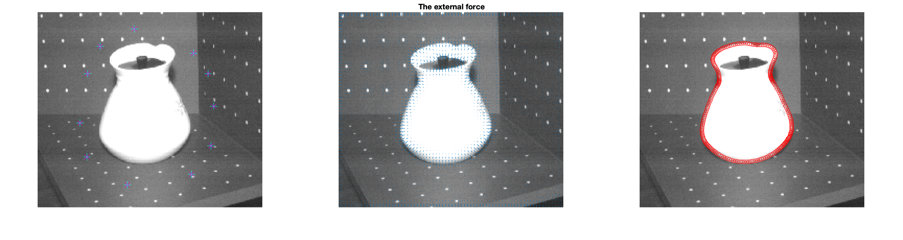
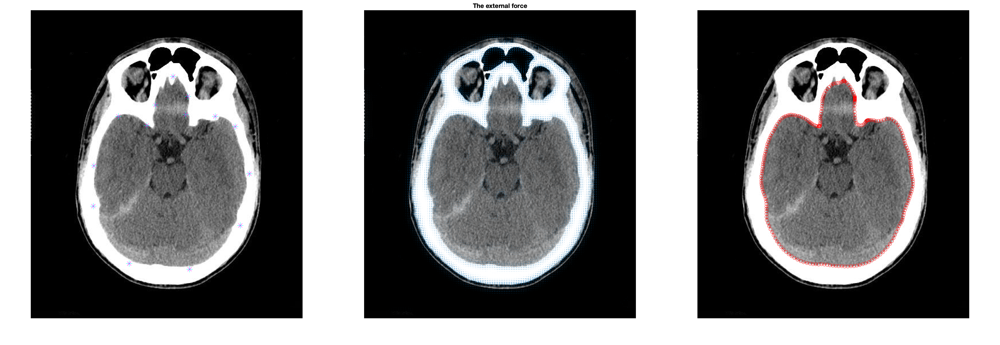
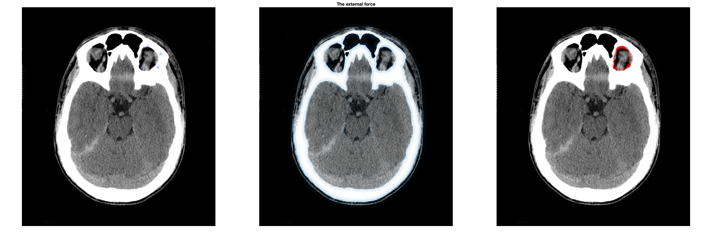
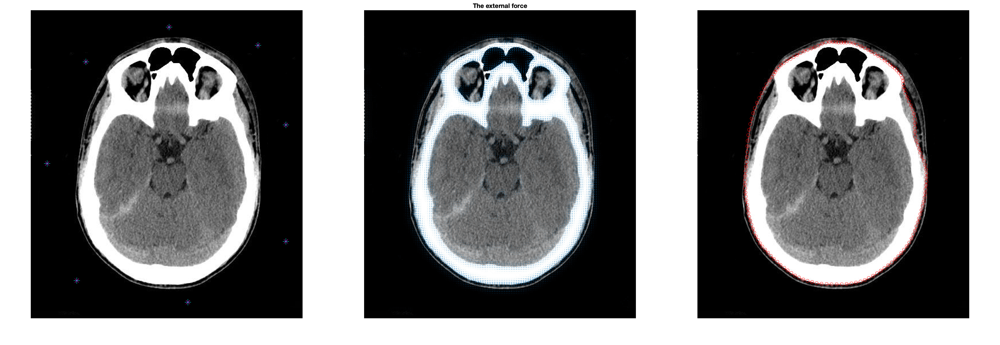

# active-contours

## Run

```
# adjust parameters depends on images
matlab main.m
```

## Results
### Shape
```
N=600; Wedge=4; Wline=1; Wterm=0.1;
sigma=10; minSigma=7.6; kernel=9; kappa=0.05;
alpha=0.2; beta=0.1; gamma=0.1;
```

### Circle
```
N=200; Wedge=4; Wline=1; Wterm=0.1;
sigma=10;
kernel=9; kappa=0.05;
alpha=0.2; beta=0.1; gamma=0.1;
```

### Square
```
N=200; Wedge=4; Wline=1; Wterm=0.1;
sigma=1;
kernel=7; kappa=0.002;
alpha=0.05; beta=0.05; gamma=0.1;
```


### Star
```
N=700; Wedge=4; Wline=1; Wterm=1;
sigma=1;
kernel=9; kappa=0.0015;
alpha=0.05; beta=0.05; gamma=0.1;
```


### Dental
```
N=400; Wedge=4; Wline=1; Wterm=0.1;
sigma=8;
kernel=9; kappa=0.05;
alpha=0.2; beta=0.1; gamma=0.1;
```

### Vase
```
N=400; Wedge=4; Wline=1; Wterm=0.1;
sigma=1;
kernel=9; kappa=0.002;
alpha=0.2; beta=0.1; gamma=0.1;
```

### Brain
```
N=400; Wedge=4; Wline=1; Wterm=0.1;
sigma=2;
kernel=11; kappa=0.002;
alpha=0.05; beta=0.05; gamma=0.1;
```

```
N=400; Wedge=4; Wline=1; Wterm=0.1;
sigma=2;
kernel=11; kappa=0.002;
alpha=0.05; beta=0.05; gamma=0.1;
```

```
N=400; Wedge=4; Wline=1; Wterm=0.1;
sigma=2;
kernel=11; kappa=0.002;
alpha=0.05; beta=0.05; gamma=0.1;
```

